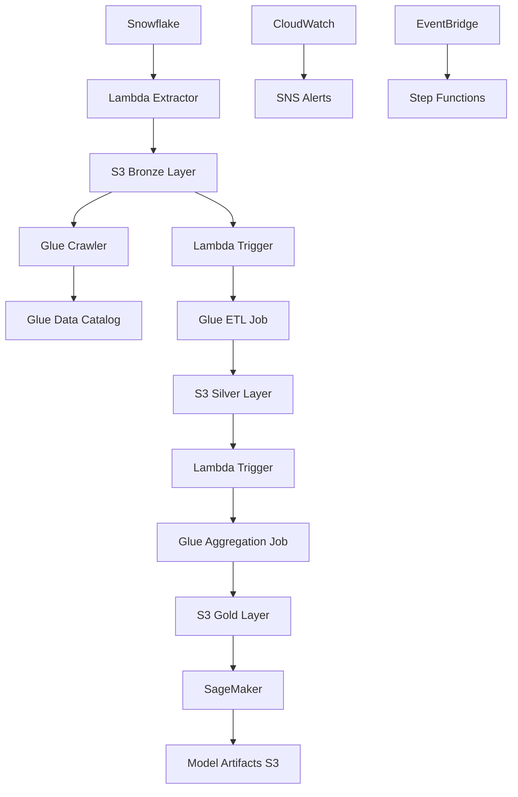
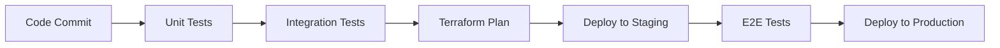

# Design Document

## Overview

This design outlines a modern, serverless data pipeline that extracts data from Snowflake and processes it through AWS services using a medallion architecture pattern. The pipeline implements event-driven processing with Lambda orchestration, uses AWS Glue for ETL operations, S3 for data lake storage, and SageMaker for ML workloads. All infrastructure is managed through Terraform using a modular approach for maintainability and reusability.

## Architecture

### High-Level Architecture

The pipeline follows a medallion architecture with three distinct layers:

- **Bronze Layer (Raw Data)**: Direct extracts from Snowflake stored in S3
- **Silver Layer (Cleaned Data)**: Processed and validated data ready for analytics
- **Gold Layer (Business Data)**: Aggregated, business-ready datasets for ML and reporting

### Data Flow



### Event-Driven Processing

The pipeline uses AWS EventBridge and S3 event notifications to trigger processing stages:

1. **Scheduled Extraction**: EventBridge triggers Lambda for Snowflake extraction
2. **Bronze Processing**: S3 PUT events trigger Glue crawlers and ETL jobs
3. **Silver Processing**: Completion events trigger aggregation jobs
4. **ML Pipeline**: Gold layer updates trigger SageMaker workflows

## Components and Interfaces

### 1. Data Extraction Layer

**Snowflake Connector Lambda**
- **Purpose**: Extract data from Snowflake using configurable SQL queries
- **Trigger**: EventBridge scheduled events or manual invocation
- **Output**: Raw data files in S3 Bronze layer
- **Key Features**:
  - Incremental data extraction using watermarks
  - Configurable batch sizes and parallel processing
  - Connection pooling and retry logic
  - Data validation and quality checks

**Configuration Interface**:
```json
{
  "extraction_config": {
    "snowflake_connection": {
      "account": "account_name",
      "warehouse": "warehouse_name",
      "database": "database_name",
      "schema": "schema_name"
    },
    "queries": [
      {
        "name": "customer_data",
        "sql": "SELECT * FROM customers WHERE updated_at > ?",
        "watermark_column": "updated_at",
        "partition_by": "date"
      }
    ],
    "output_format": "parquet",
    "compression": "snappy"
  }
}
```

### 2. Storage Layer (S3)

**Bucket Structure**:
```
data-lake-bucket/
├── bronze/
│   ├── year=2024/month=01/day=15/
│   │   ├── customers/
│   │   ├── orders/
│   │   └── products/
├── silver/
│   ├── year=2024/month=01/day=15/
│   │   ├── dim_customers/
│   │   ├── fact_orders/
│   │   └── dim_products/
├── gold/
│   ├── year=2024/month=01/day=15/
│   │   ├── customer_analytics/
│   │   ├── sales_summary/
│   │   └── ml_features/
└── artifacts/
    ├── glue_scripts/
    ├── sagemaker_models/
    └── logs/
```

**S3 Configuration**:
- **Encryption**: AES-256 server-side encryption with KMS
- **Lifecycle Policies**: Transition to IA after 30 days, Glacier after 90 days
- **Versioning**: Enabled for data lineage and recovery
- **Access Logging**: Enabled for audit trails

### 3. ETL Processing Layer (AWS Glue)

**Glue Crawlers**:
- **Bronze Crawler**: Discovers schema from raw Snowflake extracts
- **Silver Crawler**: Catalogs cleaned and validated data
- **Gold Crawler**: Catalogs business-ready aggregated data

**Glue ETL Jobs**:

**Bronze to Silver ETL**:
- Data quality validation and cleansing
- Schema standardization and type conversion
- Duplicate detection and removal
- Data profiling and statistics generation

**Silver to Gold ETL**:
- Business rule application
- Data aggregation and summarization
- Feature engineering for ML
- Performance optimization (partitioning, bucketing)

**Job Configuration Template**:
```python
# Glue Job Parameters
job_config = {
    "job_name": "bronze_to_silver_customers",
    "role": "GlueServiceRole",
    "script_location": "s3://artifacts/glue_scripts/",
    "temp_dir": "s3://artifacts/temp/",
    "job_parameters": {
        "--source_path": "s3://bronze/customers/",
        "--target_path": "s3://silver/dim_customers/",
        "--catalog_database": "data_catalog",
        "--enable_metrics": "true"
    }
}
```

### 4. Orchestration Layer (Lambda Functions)

**Pipeline Orchestrator Lambda**:
- **Purpose**: Coordinate multi-stage ETL workflows
- **Triggers**: S3 events, EventBridge schedules, Step Functions
- **Responsibilities**:
  - Job dependency management
  - Error handling and retry logic
  - Status tracking and notifications
  - Resource scaling decisions

**Data Quality Monitor Lambda**:
- **Purpose**: Validate data quality at each pipeline stage
- **Checks**: Schema validation, null checks, range validation, referential integrity
- **Actions**: Alert on quality issues, quarantine bad data, trigger reprocessing

### 5. Machine Learning Layer (SageMaker)

**SageMaker Components**:

**Feature Store Integration**:
- Automated feature ingestion from Gold layer
- Feature versioning and lineage tracking
- Online and offline feature serving

**Model Training Pipeline**:
- Automated model training on new data
- Hyperparameter tuning with SageMaker Tuning Jobs
- Model evaluation and validation
- A/B testing framework for model comparison

**Model Deployment**:
- Real-time inference endpoints
- Batch transform jobs for bulk predictions
- Multi-model endpoints for cost optimization
- Auto-scaling based on traffic patterns

### 6. Monitoring and Alerting

**CloudWatch Integration**:
- Custom metrics for pipeline performance
- Log aggregation from all components
- Automated dashboards for operational visibility

**Alerting Strategy**:
- **Critical**: Pipeline failures, data quality issues
- **Warning**: Performance degradation, cost anomalies
- **Info**: Successful completions, scheduled reports

## Data Models

### Bronze Layer Schema
```sql
-- Raw customer data from Snowflake
CREATE TABLE bronze.customers (
    customer_id STRING,
    first_name STRING,
    last_name STRING,
    email STRING,
    phone STRING,
    address STRING,
    city STRING,
    state STRING,
    zip_code STRING,
    created_at TIMESTAMP,
    updated_at TIMESTAMP,
    extraction_timestamp TIMESTAMP,
    source_system STRING
)
PARTITIONED BY (year INT, month INT, day INT)
```

### Silver Layer Schema
```sql
-- Cleaned and validated customer dimension
CREATE TABLE silver.dim_customers (
    customer_key BIGINT,
    customer_id STRING,
    full_name STRING,
    email_normalized STRING,
    phone_normalized STRING,
    address_standardized STRUCT<
        street: STRING,
        city: STRING,
        state: STRING,
        zip_code: STRING,
        country: STRING
    >,
    data_quality_score DOUBLE,
    is_active BOOLEAN,
    created_date DATE,
    last_updated_date DATE,
    effective_date DATE,
    expiration_date DATE,
    is_current BOOLEAN
)
PARTITIONED BY (year INT, month INT)
```

### Gold Layer Schema
```sql
-- Business-ready customer analytics
CREATE TABLE gold.customer_analytics (
    customer_key BIGINT,
    customer_segment STRING,
    lifetime_value DOUBLE,
    total_orders INT,
    avg_order_value DOUBLE,
    last_order_date DATE,
    churn_probability DOUBLE,
    preferred_category STRING,
    geographic_region STRING,
    analysis_date DATE
)
PARTITIONED BY (analysis_date DATE)
```

## Error Handling

### Retry Strategy
- **Exponential Backoff**: 2^n seconds with jitter
- **Maximum Retries**: 3 attempts for transient failures
- **Dead Letter Queues**: For persistent failures requiring manual intervention

### Error Categories
1. **Transient Errors**: Network timeouts, temporary service unavailability
2. **Data Errors**: Schema mismatches, data quality failures
3. **System Errors**: Resource exhaustion, permission issues
4. **Business Logic Errors**: Invalid transformations, rule violations

### Recovery Mechanisms
- **Checkpoint and Restart**: Resume processing from last successful state
- **Data Replay**: Reprocess data from specific time points
- **Fallback Procedures**: Alternative processing paths for critical data

## Testing Strategy

### Unit Testing
- **Lambda Functions**: Mock AWS services, test business logic
- **Glue Scripts**: Local testing with pytest and moto
- **Terraform Modules**: Validate resource configurations

### Integration Testing
- **End-to-End Pipeline**: Test complete data flow from Snowflake to SageMaker
- **Data Quality**: Validate transformations and business rules
- **Performance**: Load testing with realistic data volumes

### Testing Environments
- **Development**: Isolated environment for feature development
- **Staging**: Production-like environment for integration testing
- **Production**: Live environment with comprehensive monitoring

### Test Data Management
- **Synthetic Data**: Generated test datasets for development
- **Data Masking**: Anonymized production data for testing
- **Test Fixtures**: Predefined datasets for specific test scenarios

### Automated Testing Pipeline


## Security Considerations

### Identity and Access Management
- **Service Roles**: Least privilege access for each AWS service
- **Cross-Account Access**: Secure access patterns for multi-account setups
- **Temporary Credentials**: STS tokens for enhanced security

### Data Protection
- **Encryption at Rest**: KMS encryption for S3, Glue, and SageMaker
- **Encryption in Transit**: TLS 1.2+ for all data transfers
- **Key Management**: Automated key rotation and access logging

### Network Security
- **VPC Endpoints**: Private connectivity to AWS services
- **Security Groups**: Restrictive inbound/outbound rules
- **NACLs**: Additional network-level protection

### Compliance and Auditing
- **CloudTrail**: Comprehensive API logging
- **Config Rules**: Automated compliance checking
- **Access Logging**: Detailed audit trails for data access