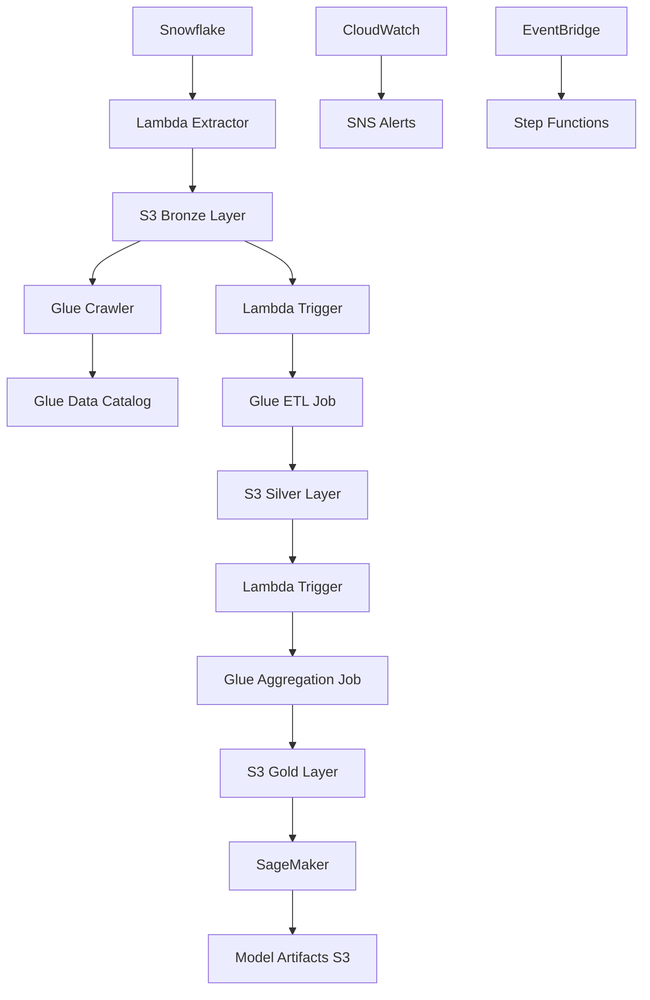

# Architecture Documentation

This document provides a detailed overview of the Snowflake AWS Pipeline architecture.

## High-Level Architecture

The pipeline follows a medallion architecture with three distinct layers:

- **Bronze Layer (Raw Data)**: Direct extracts from Snowflake stored in S3
- **Silver Layer (Cleaned Data)**: Processed and validated data ready for analytics
- **Gold Layer (Business Data)**: Aggregated, business-ready datasets for ML and reporting

## Architecture Diagram



## Component Details

### 1. Data Extraction Layer

**Snowflake Connector Lambda**
- Extracts data from Snowflake using configurable SQL queries
- Triggered by EventBridge scheduled events or manual invocation
- Outputs raw data files to S3 Bronze layer
- Features:
  - Incremental data extraction using watermarks
  - Configurable batch sizes and parallel processing
  - Connection pooling and retry logic
  - Data validation and quality checks

### 2. Storage Layer (S3)

**Bucket Structure**:
```
data-lake-bucket/
├── bronze/
│   ├── year=2024/month=01/day=15/
│   │   ├── customers/
│   │   ├── orders/
│   │   └── products/
├── silver/
│   ├── year=2024/month=01/day=15/
│   │   ├── dim_customers/
│   │   ├── fact_orders/
│   │   └── dim_products/
├── gold/
│   ├── year=2024/month=01/day=15/
│   │   ├── customer_analytics/
│   │   ├── sales_summary/
│   │   └── ml_features/
└── artifacts/
    ├── glue_scripts/
    ├── sagemaker_models/
    └── logs/
```

**S3 Configuration**:
- Encryption: AES-256 server-side encryption with KMS
- Lifecycle Policies: Transition to IA after 30 days, Glacier after 90 days
- Versioning: Enabled for data lineage and recovery
- Access Logging: Enabled for audit trails

### 3. ETL Processing Layer (AWS Glue)

**Glue Crawlers**:
- Bronze Crawler: Discovers schema from raw Snowflake extracts
- Silver Crawler: Catalogs cleaned and validated data
- Gold Crawler: Catalogs business-ready aggregated data

**Glue ETL Jobs**:
- Bronze to Silver ETL: Data quality validation, cleansing, and standardization
- Silver to Gold ETL: Business rule application, aggregation, and feature engineering

### 4. Orchestration Layer (Lambda Functions)

**Pipeline Orchestrator Lambda**:
- Coordinates multi-stage ETL workflows
- Manages job dependencies, error handling, and status tracking

**Data Quality Monitor Lambda**:
- Validates data quality at each pipeline stage
- Performs schema validation, null checks, and range validation

### 5. Machine Learning Layer (SageMaker)

**Feature Store Integration**:
- Automated feature ingestion from Gold layer
- Feature versioning and lineage tracking

**Model Training Pipeline**:
- Automated model training on new data
- Hyperparameter tuning and model evaluation

**Model Deployment**:
- Real-time inference endpoints
- Batch transform jobs for bulk predictions

### 6. Monitoring and Alerting

**CloudWatch Integration**:
- Custom metrics for pipeline performance
- Log aggregation from all components
- Automated dashboards for operational visibility

**Alerting Strategy**:
- Critical: Pipeline failures, data quality issues
- Warning: Performance degradation, cost anomalies
- Info: Successful completions, scheduled reports

## Security Architecture

### Identity and Access Management
- Service Roles: Least privilege access for each AWS service
- Cross-Account Access: Secure access patterns for multi-account setups
- Temporary Credentials: STS tokens for enhanced security

### Data Protection
- Encryption at Rest: KMS encryption for S3, Glue, and SageMaker
- Encryption in Transit: TLS 1.2+ for all data transfers
- Key Management: Automated key rotation and access logging

### Network Security
- VPC Endpoints: Private connectivity to AWS services
- Security Groups: Restrictive inbound/outbound rules
- NACLs: Additional network-level protection

## Scaling Considerations

### Horizontal Scaling
- Lambda concurrency for parallel data extraction
- Glue DPUs auto-scaling based on data volume
- SageMaker instance auto-scaling for inference endpoints

### Vertical Scaling
- Configurable memory allocation for Lambda functions
- Adjustable worker count for Glue jobs
- Instance type selection for SageMaker workloads

## Cost Optimization

- S3 lifecycle policies for automatic data tiering
- Glue job bookmarks to avoid reprocessing data
- Spot instances for non-critical workloads
- Reserved instances for predictable workloads