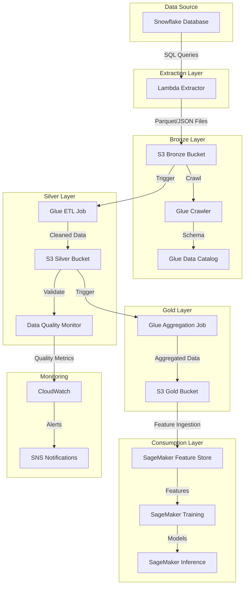

# Data Flow Documentation

This document describes the data flow through the Snowflake AWS Pipeline.

## Overview

The data pipeline follows a medallion architecture pattern with three distinct layers:

1. **Bronze Layer**: Raw data extracted from Snowflake
2. **Silver Layer**: Cleaned and validated data
3. **Gold Layer**: Business-ready data for analytics and ML

## Data Flow Diagram



## Data Flow Stages

### 1. Data Extraction

**Process**:
1. Lambda extractor connects to Snowflake using credentials from AWS Secrets Manager
2. Executes configurable SQL queries with watermark-based incremental extraction
3. Processes data in configurable batch sizes
4. Validates extracted data against basic quality rules
5. Writes data to S3 Bronze layer in Parquet or JSON format
6. Updates watermark in DynamoDB for next extraction

**Configuration Example**:
```json
{
  "batch_size": 10000,
  "max_batches": 100,
  "max_retries": 3,
  "output_format": "parquet",
  "queries": [
    {
      "name": "customers",
      "sql": "SELECT * FROM customers WHERE updated_at > ?",
      "watermark_column": "updated_at",
      "partition_by": "date"
    }
  ]
}
```

### 2. Bronze Layer Processing

**Process**:
1. S3 event notifications trigger Glue crawlers
2. Crawlers discover schema and update Glue Data Catalog
3. Data is now queryable through Athena or other AWS analytics services
4. Lambda trigger initiates Bronze to Silver ETL process

**Data Format**: 
- Raw data in Parquet or JSON format
- Partitioned by extraction date and entity type
- Original schema from Snowflake preserved

### 3. Silver Layer Processing

**Process**:
1. Glue ETL job reads data from Bronze layer
2. Performs data cleaning and validation:
   - Schema standardization
   - Data type conversions
   - Duplicate detection and removal
   - Null handling and default values
3. Applies data quality checks
4. Writes cleaned data to Silver layer
5. Data Quality Monitor Lambda validates results

**Data Format**:
- Cleaned data in Parquet format
- Optimized partitioning for query performance
- Standardized schema with consistent data types

### 4. Gold Layer Processing

**Process**:
1. Glue ETL job reads data from Silver layer
2. Applies business rules and transformations
3. Creates aggregations and derived metrics
4. Generates features for machine learning
5. Writes business-ready data to Gold layer

**Data Format**:
- Business-ready data in Parquet format
- Aggregated and summarized for analytics
- Feature-engineered for ML workloads

### 5. Machine Learning Integration

**Process**:
1. Lambda function ingests Gold layer data into SageMaker Feature Store
2. SageMaker training jobs use features for model training
3. Models are evaluated and registered in SageMaker Model Registry
4. Approved models are deployed to SageMaker endpoints for inference

## Data Models

### Bronze Layer Schema Example
```sql
-- Raw customer data from Snowflake
CREATE TABLE bronze.customers (
    customer_id STRING,
    first_name STRING,
    last_name STRING,
    email STRING,
    phone STRING,
    address STRING,
    city STRING,
    state STRING,
    zip_code STRING,
    created_at TIMESTAMP,
    updated_at TIMESTAMP,
    extraction_timestamp TIMESTAMP,
    source_system STRING
)
PARTITIONED BY (year INT, month INT, day INT)
```

### Silver Layer Schema Example
```sql
-- Cleaned and validated customer dimension
CREATE TABLE silver.dim_customers (
    customer_key BIGINT,
    customer_id STRING,
    full_name STRING,
    email_normalized STRING,
    phone_normalized STRING,
    address_standardized STRUCT<
        street: STRING,
        city: STRING,
        state: STRING,
        zip_code: STRING,
        country: STRING
    >,
    data_quality_score DOUBLE,
    is_active BOOLEAN,
    created_date DATE,
    last_updated_date DATE,
    effective_date DATE,
    expiration_date DATE,
    is_current BOOLEAN
)
PARTITIONED BY (year INT, month INT)
```

### Gold Layer Schema Example
```sql
-- Business-ready customer analytics
CREATE TABLE gold.customer_analytics (
    customer_key BIGINT,
    customer_segment STRING,
    lifetime_value DOUBLE,
    total_orders INT,
    avg_order_value DOUBLE,
    last_order_date DATE,
    churn_probability DOUBLE,
    preferred_category STRING,
    geographic_region STRING,
    analysis_date DATE
)
PARTITIONED BY (analysis_date DATE)
```

## Data Lineage

The pipeline maintains data lineage through:

1. **Extraction Metadata**: Each extracted file includes source system, query, and extraction timestamp
2. **Processing Tags**: ETL jobs add processing metadata including job ID and timestamp
3. **Glue Data Catalog**: Maintains schema evolution history
4. **CloudTrail**: Logs all API calls for audit purposes

## Data Quality Monitoring

Data quality is monitored at multiple stages:

1. **Extraction**: Basic validation against configurable rules
2. **Silver Layer**: Comprehensive data quality checks
3. **Gold Layer**: Business rule validation
4. **Continuous Monitoring**: Data Quality Monitor Lambda runs scheduled checks

## Error Handling

The pipeline implements robust error handling:

1. **Retry Logic**: Exponential backoff for transient failures
2. **Dead Letter Queues**: Capture failed processing for investigation
3. **Quarantine Buckets**: Store invalid data for later processing
4. **Alerting**: SNS notifications for critical failures