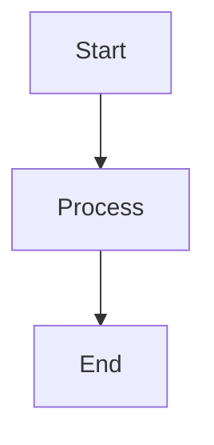

# Documentation Guide

This guide explains how to maintain and update documentation for the Snowflake AWS Pipeline project.

## Documentation Structure

The project documentation is organized as follows:

```
docs/
├── README.md                  # Main documentation entry point
├── architecture/              # System architecture documentation
├── data_flow/                 # Data flow diagrams and descriptions
├── deployment/                # Deployment guides and procedures
├── documentation_guide.md     # This guide
├── generated/                 # Auto-generated documentation
│   ├── lambda/                # Lambda function documentation
│   ├── terraform/             # Terraform module documentation
│   ├── config/                # Configuration schema documentation
│   └── diagrams/              # Resource relationship diagrams
├── scripts/                   # Documentation generation scripts
└── troubleshooting/           # Troubleshooting guides
```

## Documentation Types

The project includes several types of documentation:

1. **Manual Documentation**: Handwritten guides and explanations in Markdown format
2. **Generated Documentation**: Automatically extracted from code and configuration files
3. **Diagrams**: Visual representations of architecture and data flows

## Maintaining Documentation

### Manual Documentation

To update manual documentation:

1. Edit the relevant Markdown files in the `docs/` directory
2. Follow the established formatting conventions
3. Include code examples, diagrams, and links where appropriate
4. Submit changes through the standard code review process

### Generated Documentation

Generated documentation is automatically created from code comments, configuration files, and other sources. To update:

1. Update the source code comments and docstrings
2. Run the documentation generation script:

```bash
cd docs/scripts
python generate_docs.py --all
```

### Documentation Generation Script

The `generate_docs.py` script extracts documentation from:

- Lambda function docstrings and comments
- Terraform module definitions
- Configuration schemas and examples
- Resource relationships

Available options:

```
--lambda-docs    Generate Lambda documentation
--terraform      Generate Terraform documentation
--config         Generate configuration schema documentation
--diagram        Generate resource diagram
--all            Generate all documentation (default)
```

## Documentation Best Practices

### General Guidelines

1. **Keep Documentation Updated**: Update documentation when code changes
2. **Be Concise**: Write clear, concise explanations
3. **Use Examples**: Include code examples and configuration snippets
4. **Add Diagrams**: Use diagrams to explain complex concepts
5. **Link Related Documents**: Cross-reference related documentation

### Code Documentation

1. **Use Docstrings**: Add docstrings to all functions, classes, and modules
2. **Document Parameters**: Describe all parameters and return values
3. **Explain Complex Logic**: Add comments for complex code sections
4. **Include Examples**: Provide usage examples in docstrings

### Configuration Documentation

1. **Document All Options**: Describe all configuration options
2. **Provide Examples**: Include example configurations
3. **Explain Defaults**: Document default values and their implications
4. **Describe Constraints**: Note any constraints or validation rules

## Adding New Documentation

### Adding a New Guide

To add a new guide:

1. Create a new Markdown file in the appropriate directory
2. Follow the established formatting conventions
3. Update the main README.md to link to the new guide
4. Submit changes through the standard code review process

### Adding a New Documentation Type

To add a new type of documentation:

1. Create a new directory under `docs/`
2. Add a README.md file explaining the purpose of the documentation
3. Update this guide to include the new documentation type
4. Update the documentation generation script if needed

## Documentation Formats

### Markdown

Most documentation is written in Markdown format. Follow these conventions:

- Use ATX-style headers (`#` for h1, `##` for h2, etc.)
- Use fenced code blocks with language specifiers
- Use bullet lists for unordered lists
- Use numbered lists for sequential steps
- Use tables for structured data

### Diagrams

Diagrams are created using:

- **Mermaid**: For flow diagrams, sequence diagrams, and entity relationship diagrams
- **Terraform Graph**: For resource relationship diagrams

To add a Mermaid diagram:

````markdown

````

```

## CI/CD Integration

Documentation is automatically validated and generated as part of the CI/CD pipeline:

1. Markdown files are linted for formatting issues
2. Code documentation is extracted and validated
3. Generated documentation is updated
4. Documentation is published to the project wiki

## Troubleshooting Documentation Issues

### Missing Generated Documentation

If generated documentation is missing:

1. Check that source code includes proper docstrings and comments
2. Verify that the documentation generation script is working correctly
3. Check for errors in the CI/CD pipeline logs

### Diagram Generation Issues

If diagrams fail to generate:

1. Ensure Graphviz is installed for diagram conversion
2. Check Mermaid syntax in diagram definitions
3. Verify that Terraform is properly initialized for graph generation
```
